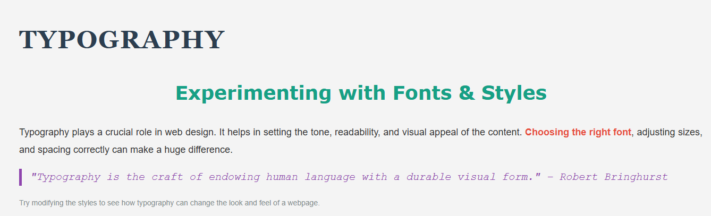

# typography

## 📌 Description
The Typography Webpage is a simple HTML and CSS project demonstrating the importance of typography in web design. It showcases different fonts, styles, spacing, and alignment techniques to enhance readability and aesthetic appeal.

## 🛠 Prerequisites
N/A

## 📋 Criteria
* Use of multiple font families.
* Effective text alignment and spacing.
* Proper use of blockquotes, headings, and paragraph styling.
* Highlighting important text.

## 💻 Technologies Used
The application is built with the following technologies:
* HTML
* CSS

## 🚀 Installation
No installation is required to use the app. It is hosted online and can be accessed via a web browser.

## 📚 Usage
1. Open the webpage to explore different typography elements.

## 🔗 Live Demo & Repository
Application can be viewed here: 
* [Live](https://yvonnesarah.github.io/typography/)

* [Repository](https://github.com/yvonnesarah/typography)

## 🖼 Screenshot
Below is a preview of Typography:

## 👥 Credit
N/A

## 📜 License
This project is open-source. For licensing details, please refer to the LICENSE file in the repository.

## 📬 Contact
You can reach me at 📧 yvonneadedeji.sarah@gmail.com.
